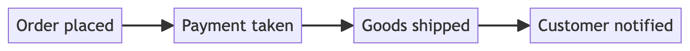
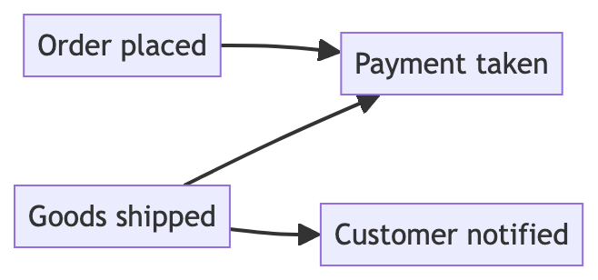
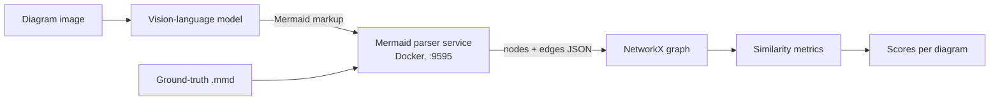

# vlm-diagram-eval

[](https://github.com/UlviShukurzade/vlm-diagram-eval/actions/workflows/ci.yml)
[](https://www.python.org/downloads/)
[](LICENSE)

**Vision-language models read photographs well. Diagrams are a different problem — and this
measures exactly where they break.**

A photograph carries its meaning in appearance: textures, objects, scenes. A technical diagram
carries almost none of its meaning that way. What a flowchart *means* lives in its **structure** —
which node points to which, which way the arrow runs, what sits inside which container, where the
branches fork. Two diagrams can look nearly identical and mean opposite things because one arrow is
reversed.

That makes diagram understanding a structural-reasoning task wearing the costume of a vision task.
**A model can recognise every box and label correctly and still reconstruct the wrong system**.

<p align="center">
  
</p>

**Arrows are the Achilles' heel.** Reading the markup, models count edges *more* accurately than
nodes — 0.63 against 1.49 mean error. Take the text away and edge error rises three to five times
faster than node error (GPT-4.1: +76% vs +27%; o4-mini: +20% vs +4%). Edges are not a weakness
models bring to the task. Vision creates one.

## The approach: measure, don't fine-tune

The obvious response to a model doing badly is more training data or a fine-tune. This work takes
the other route: build an **evaluation framework** that says precisely *which* structural properties
defeat current models, and establish it statistically rather than anecdotally.

The mechanism is a round-trip. A model is shown a rendered diagram and asked to emit Mermaid markup.
Both its answer and the ground-truth source are parsed into attributed graphs by Mermaid's own
parser, then compared with graph-theoretic similarity measures. The score reflects whether the
*topology* survived — not whether the wording matched.

Because the comparison is structural, it decomposes. Every diagram is scored on node count, edge
count, connectivity, branching, and nesting depth, so failures can be attributed to a specific kind
of structure instead of a single opaque number. The same counting task is then run twice — once from
the image, once from the markup — and the difference isolates what vision itself costs.

## The finding: arrows are the weakest link

Ask a model to count a diagram's parts twice — once from the Mermaid source, once from a picture of
the same diagram — and the difference is the price of having to *look*. Doing this for all four
structural components ranks them by how badly each survives the loss of text:

| How much error grows when reading a picture instead of the source | GPT-4.1 | GPT-o4-mini |
|---|---|---|
| **Edges (arrows)** | **1.8× the error** | **1.2× the error** |
| Containers (nesting) | 1.5× | 0.9× — slightly better |
| Nodes | 1.3× | 1.0× — unchanged |
| Branches (decisions) | 0.8× — slightly better | 1.1× |

*Higher is worse. 1.0× means vision cost the model nothing.*

**Arrows rank worst for both models** — the component most damaged by vision, not merely worse than
nodes. GPT-4.1's edge error nearly doubles; nodes rise by a third; two components
actually improve slightly.

The reason is structural. A node is a labelled box: one visible object, and the label alone often
identifies it. An arrow is a thin line whose meaning depends on three things at once — its start,
its end, and its direction — none of which is written down anywhere in the image. Lose the text and
you lose the redundancy that made edges *easier* than nodes to count from source (0.63 vs 1.49 mean
error).

A regression over all similarity scores confirms it from the other side: edge count is a significant
**negative** predictor of reconstruction quality, while node count turns **positive** once edge
density is held constant. Bigger diagrams are not harder — more densely *connected* ones are.
Nesting is the second negative signal, which is why containers rank second in the table above.

This is why the framework reports flipped, missing, and hallucinated edges as three separate counts
rather than one score — and why it runs four metrics instead of one.

### One arrow, demonstrated

Same four steps. Same three connections. One arrow reversed.

| Ground truth | One edge reversed |
|---|---|
|  |  |
| payment is taken, *then* goods ship | goods ship, *then* payment is taken |

The second diagram describes a business that ships before it gets paid. Now score it:

| Metric | Score | Verdict |
|---|---|---|
| `UndirectedSpectralSimilarity` | **1.000** | perfect — completely blind to it |
| `DirectedSpectralSimilarity` | 0.993 | a 0.7% penalty for inverting the logic |
| `WLSimilarityGrakel` | 0.500 | catches it |
| `DirectedErrorEvaluator` | `flipped = 1` | names it exactly |

A single reversed arrow inverts what the diagram *means* while one metric still calls it a perfect
match. That is the case for structural, direction-aware, decomposed evaluation rather than one
aggregate number — and the reason the error taxonomy reports flipped edges as their own count.

Regenerate with `make parser && make render` from
[`docs/figures/arrow-direction/`](docs/figures/arrow-direction).

---

Built for a master's thesis, *AI-Driven Understanding and Evaluation of Technical Diagrams via
Markup-Based Representations* (University of Bonn / b-it, 2026).

Corpus: 14,487 human-authored Mermaid diagrams scraped from GitHub, filtered to 12,525, with a
stratified subset of **900** used for evaluation — 100 per difficulty tier per diagram type.
Class diagrams are in the corpus but excluded from evaluation: their object-oriented semantics
differ too much from control-flow topology.

---

## How it works



The parser service is the piece that makes this trustworthy. Rather than writing a Mermaid parser
and inheriting its blind spots, it runs Mermaid's own parser (`mermaid.mermaidAPI`) inside a
container and returns the node and edge structure Mermaid itself derived. Ground truth and model
output go through the identical path, so any parser quirk cancels out.

## Metrics

| Metric | What it captures |
|---|---|
| `WLSimilarityGrakel` | Weisfeiler-Lehman kernel over labelled nodes and edges — the headline metric |
| `DirectedSpectralSimilarity` | Laplacian spectrum of the directed graph |
| `UndirectedSpectralSimilarity` | Same, ignoring edge direction |
| `DirectedErrorEvaluator` | Directed structural F1 plus error taxonomy: missing, hallucinated, **flipped** |

Matching thesis §4.3: WL captures local neighbourhood consistency, spectral similarity captures
global connectivity, and directed F1 verifies exact edge-level correctness. WL uses h = 3
refinement iterations, as specified in §4.3.1.

`DirectedErrorEvaluator` exists because a single aggregate score hides the failure mode that matters
most in practice — an edge transcribed in the wrong direction. It reports that count separately.

## Results

Average WL similarity, GPT-4.1 vs GPT-o4-mini across four prompt tiers. Higher is better.

| Diagram | Difficulty | GPT-4.1 base | GPT-4.1 v3 | o4-mini base | o4-mini v3-high |
|---|---|---|---|---|---|
| Flowchart | Easy | 0.840 | **0.892** | 0.820 | **0.888** |
| Flowchart | Moderate | 0.701 | 0.731 | 0.773 | 0.818 |
| Flowchart | Hard | 0.727 | 0.652 | 0.731 | 0.726 |
| Graph | Easy | 0.860 | **0.885** | 0.902 | **0.919** |
| Graph | Moderate | 0.774 | 0.800 | 0.853 | 0.861 |
| Graph | Hard | 0.701 | 0.763 | 0.768 | 0.765 |
| State diagram | Easy | 0.658 | 0.748 | 0.705 | 0.722 |
| State diagram | Moderate | 0.462 | 0.430 | 0.455 | 0.481 |
| State diagram | Hard | 0.332 | 0.356 | 0.338 | **0.358** |

Three findings:

**State diagrams are a different problem.** Flowcharts and graphs land between 0.65 and 0.92. State
diagrams collapse to 0.33–0.75, and hard state diagrams score roughly half what hard flowcharts do.
Nested states and implicit initial/final transitions are where transcription breaks down.

**Prompt engineering helps least where it is needed most.** The richest prompt tier (v3) wins on easy
diagrams but its advantage shrinks — and sometimes reverses — as difficulty rises. On hard
flowcharts, GPT-4.1's base prompt beats v3.

**Relational density, not diagram size, drives failure.** A linear regression over all similarity
scores (N = 24,300, HC3 robust standard errors; F = 244.7, p < 0.001, R² = 0.104):

| Predictor | β | Direction |
|---|---|---|
| Parent count (nesting) | −0.0414 | negative |
| Edge count | −0.0317 | negative |
| Node count | +0.0194 | positive |
| Decision count | +0.0189 | positive |

Edges and hierarchical nesting reduce similarity. Node and decision counts turn *positive* once
edge density is controlled for — so raw size is not the difficulty factor; relational and
hierarchical complexity is.

Figures in [`docs/figures/`](docs/figures), LaTeX tables in [`docs/tables/`](docs/tables).

## Quickstart

```bash
git clone https://github.com/UlviShukurzade/vlm-diagram-eval.git
cd vlm-diagram-eval
make setup     # uv sync + pre-commit hooks
make parser    # build and start the parser service on :9595
make test
```

No API key and no dataset download are needed for the test suite — 24 sample diagrams are committed
under [`data/sample/`](data/sample), spanning four diagram types and three difficulty levels.
(Class diagrams are included in the sample for parser coverage, though the thesis excludes them
from evaluation.)

Scoring one transcription:

```python
from vlm_diagram_eval.evaluators.metrics import WLSimilarityGrakel

truth = open("data/sample/flowchart/Easy/flowchart_10016_6.mmd").read()
generated = "graph TD; A[Start] --> B[End];"

print(WLSimilarityGrakel().evaluate(truth, generated))
```

Every evaluator takes either Mermaid strings or NetworkX graphs, and exposes the same
`name()` / `evaluate(truth, generated)` pair — so adding a metric means adding one class.

## Thesis coverage

All three experiments the thesis defines are implemented here, and two of them **reproduce published
values** rather than merely matching the written specification.

| Thesis section | Covered here |
|---|---|
| §4.1.2 Rendering | `scripts/render_diagrams.py` — Playwright with the pinned mermaid build under `vendor/` |
| §4.2 Graph conversion | `parsing/graph.py` — label normalisation, directed edge induction, NetworkX node-link |
| §4.3 Similarity measures | `evaluators/metrics.py` — WL (h = 3), directed/undirected spectral, directed F1 |
| §4.4 Structural Complexity Index | `analysis/complexity.py` — **reproduces the thesis's own `sci_*` values** across all 9 type × difficulty cells |
| §5.1 Structural reconstruction (RQ1, RQ2) | image → Mermaid, all four prompt tiers |
| §5.2 Component quantification (MAE) | `evaluators/quantification.py` — **reproduces Table 5.13 exactly** from raw model responses |
| §5.3 Modality gap (RQ3) | `scripts/modality_gap.py` — every published ΔMAE reproduced |

The two reproduction claims are enforced by tests, so drift fails the build rather than going
unnoticed.

## Reproducibility

Long-lived results need a pinned toolchain, so:

- The parser service pins its base image **by digest** (`node@sha256:e4bf2a82…`) and installs with
  `npm ci` from a committed 240-package lockfile. Rebuilds are byte-identical — verified by
  rebuilding and diffing installed versions (mermaid 11.12.2, express 4.22.1, 181 packages,
  Node v22.22.0).
- `uv.lock` is committed and every runtime import is a declared dependency.
- Tests touch no network beyond the local container.
- Two published results are verified, not just implemented. `tests/test_complexity.py` re-derives
  the `sci_*` components for 36 diagrams across all nine type × difficulty cells;
  `tests/test_quantification.py` recomputes every per-prompt MAE from the raw model responses and
  matches Table 5.13 to 1e-6.

- The renderer uses the thesis's own `mermaid.min.js`, committed byte-for-byte under `vendor/`.
  The mermaid build dominates render output: with it, a re-render of `flowchart_5087_23` is
  3001×452 against the original 3036×450 (~1%, from font metrics); with a released 11.12.2 it is
  4171×565 (~37% off). Renders are close but not byte-identical across machines — use a container
  with pinned fonts if you need exact pixels.

## Layout

```
src/vlm_diagram_eval/
├── evaluators/metrics.py   # the four similarity metrics
├── parsing/graph.py        # parser-service client → NetworkX
├── llm/                    # Azure OpenAI callers + prompt tiers
├── analysis/               # dataset statistics and complexity index
└── compat.py               # numpy 2 / grakel shim (documented)
services/mermaid_parser/    # the Dockerised Mermaid parser
notebooks/                  # evaluation pipeline, statistics, worked example
docs/                       # figures and LaTeX tables
data/sample/                # 24 diagrams, committed
```

## Configuration

Only the LLM calls need credentials. Copy `.env.example` to `.env`:

```bash
AZURE_OPENAI_API_KEY=...
AZURE_OPENAI_ENDPOINT=https://<your-resource>.openai.azure.com/
```

## Citation

See [`CITATION.cff`](CITATION.cff).

## Acknowledgements

Research, methodology, and results are the author's own, from the master's thesis named above.
Repository structure, test suite, and documentation were developed with AI assistance (Claude).

## License

MIT — see [LICENSE](LICENSE).

`vendor/mermaid.min.js` is a third-party build of [Mermaid](https://github.com/mermaid-js/mermaid),
also MIT, attributed in [`vendor/README.md`](vendor/README.md).
