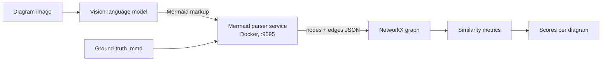

# vlm-diagram-eval

[](https://github.com/UlviShukurzade/vlm-diagram-eval/actions/workflows/ci.yml)
[](https://www.python.org/downloads/)
[](LICENSE)

**How faithfully do vision-language models transcribe technical diagrams?**

This measures it directly. A diagram image goes to a VLM, which returns Mermaid markup. That markup
is parsed into a graph, and the graph is compared against ground truth using structural similarity
metrics — so the score reflects whether the *structure* survived transcription, not whether the text
happens to match.

Built for a master's thesis, *AI-Driven Understanding and Evaluation of Technical Diagrams via
Markup-Based Representations*.

---

## How it works



The parser service is the piece that makes this trustworthy. Rather than writing a Mermaid parser
and inheriting its blind spots, it runs Mermaid's own parser (`mermaid.mermaidAPI`) inside a
container and returns the node and edge structure Mermaid itself derived. Ground truth and model
output go through the identical path, so any parser quirk cancels out.

## Metrics

| Metric | What it captures |
|---|---|
| `WLSimilarityGrakel` | Weisfeiler-Lehman kernel over labelled nodes and edges — the headline metric |
| `DirectedSpectralSimilarity` | Laplacian spectrum of the directed graph |
| `UndirectedSpectralSimilarity` | Same, ignoring edge direction |
| `DirectedErrorEvaluator` | Interpretable error counts: missing, hallucinated, and **flipped** edges |

`DirectedErrorEvaluator` exists because a single aggregate score hides the failure mode that matters
most in practice — an edge transcribed in the wrong direction. It reports that count separately.

## Results

Average WL similarity, GPT-4.1 vs GPT-o4-mini across four prompt tiers. Higher is better.

| Diagram | Difficulty | GPT-4.1 base | GPT-4.1 v3 | o4-mini base | o4-mini v3-high |
|---|---|---|---|---|---|
| Flowchart | Easy | 0.840 | **0.892** | 0.820 | **0.888** |
| Flowchart | Moderate | 0.701 | 0.731 | 0.773 | 0.818 |
| Flowchart | Hard | 0.727 | 0.652 | 0.731 | 0.726 |
| Graph | Easy | 0.860 | **0.885** | 0.902 | **0.919** |
| Graph | Moderate | 0.774 | 0.800 | 0.853 | 0.861 |
| Graph | Hard | 0.701 | 0.763 | 0.768 | 0.765 |
| State diagram | Easy | 0.658 | 0.748 | 0.705 | 0.722 |
| State diagram | Moderate | 0.462 | 0.430 | 0.455 | 0.481 |
| State diagram | Hard | 0.332 | 0.356 | 0.338 | **0.358** |

Three findings:

**State diagrams are a different problem.** Flowcharts and graphs land between 0.65 and 0.92. State
diagrams collapse to 0.33–0.75, and hard state diagrams score roughly half what hard flowcharts do.
Nested states and implicit initial/final transitions are where transcription breaks down.

**Prompt engineering helps least where it is needed most.** The richest prompt tier (v3) wins on easy
diagrams but its advantage shrinks — and sometimes reverses — as difficulty rises. On hard
flowcharts, GPT-4.1's base prompt beats v3.

**Failure tracks structural complexity, not size.** Spearman correlation between WL similarity and
components of the structural complexity index (GPT-4.1, v3):

| Component | Spearman ρ |
|---|---|
| Edges | −0.369 |
| Nodes | −0.324 |
| Nesting | −0.231 |
| Decision points | −0.223 |
| Connectivity | −0.169 |

Edge count degrades transcription more than node count — models track *entities* better than the
*relationships* between them.

Figures in [`docs/figures/`](docs/figures), LaTeX tables in [`docs/tables/`](docs/tables).

## Quickstart

```bash
git clone https://github.com/UlviShukurzade/vlm-diagram-eval.git
cd vlm-diagram-eval
make setup     # uv sync + pre-commit hooks
make parser    # build and start the parser service on :9595
make test
```

No API key and no dataset download are needed for the test suite — 24 sample diagrams are committed
under [`data/sample/`](data/sample), spanning four diagram types and three difficulty levels.

Scoring one transcription:

```python
from vlm_diagram_eval.evaluators.metrics import WLSimilarityGrakel

truth = open("data/sample/flowchart/Easy/flowchart_10016_6.mmd").read()
generated = "graph TD; A[Start] --> B[End];"

print(WLSimilarityGrakel().evaluate(truth, generated))
```

Every evaluator takes either Mermaid strings or NetworkX graphs, and exposes the same
`name()` / `evaluate(truth, generated)` pair — so adding a metric means adding one class.

## Reproducibility

Long-lived results need a pinned toolchain, so:

- The parser service pins its base image **by digest** (`node@sha256:e4bf2a82…`) and installs with
  `npm ci` from a committed 240-package lockfile. Rebuilds are byte-identical — verified by
  rebuilding and diffing installed versions (mermaid 11.12.2, express 4.22.1, 181 packages,
  Node v22.22.0).
- `uv.lock` is committed and every runtime import is a declared dependency.
- Tests touch no network beyond the local container.

## Layout

```
src/vlm_diagram_eval/
├── evaluators/metrics.py   # the four similarity metrics
├── parsing/graph.py        # parser-service client → NetworkX
├── llm/                    # Azure OpenAI callers + prompt tiers
├── analysis/               # dataset statistics and complexity index
└── compat.py               # numpy 2 / grakel shim (documented)
services/mermaid_parser/    # the Dockerised Mermaid parser
notebooks/                  # evaluation pipeline, ANOVA, worked example
docs/                       # figures and LaTeX tables
data/sample/                # 24 diagrams, committed
```

## Configuration

Only the LLM calls need credentials. Copy `.env.example` to `.env`:

```bash
AZURE_OPENAI_API_KEY=...
AZURE_OPENAI_ENDPOINT=https://<your-resource>.openai.azure.com/
```

## Citation

See [`CITATION.cff`](CITATION.cff).

## License

MIT — see [LICENSE](LICENSE).
